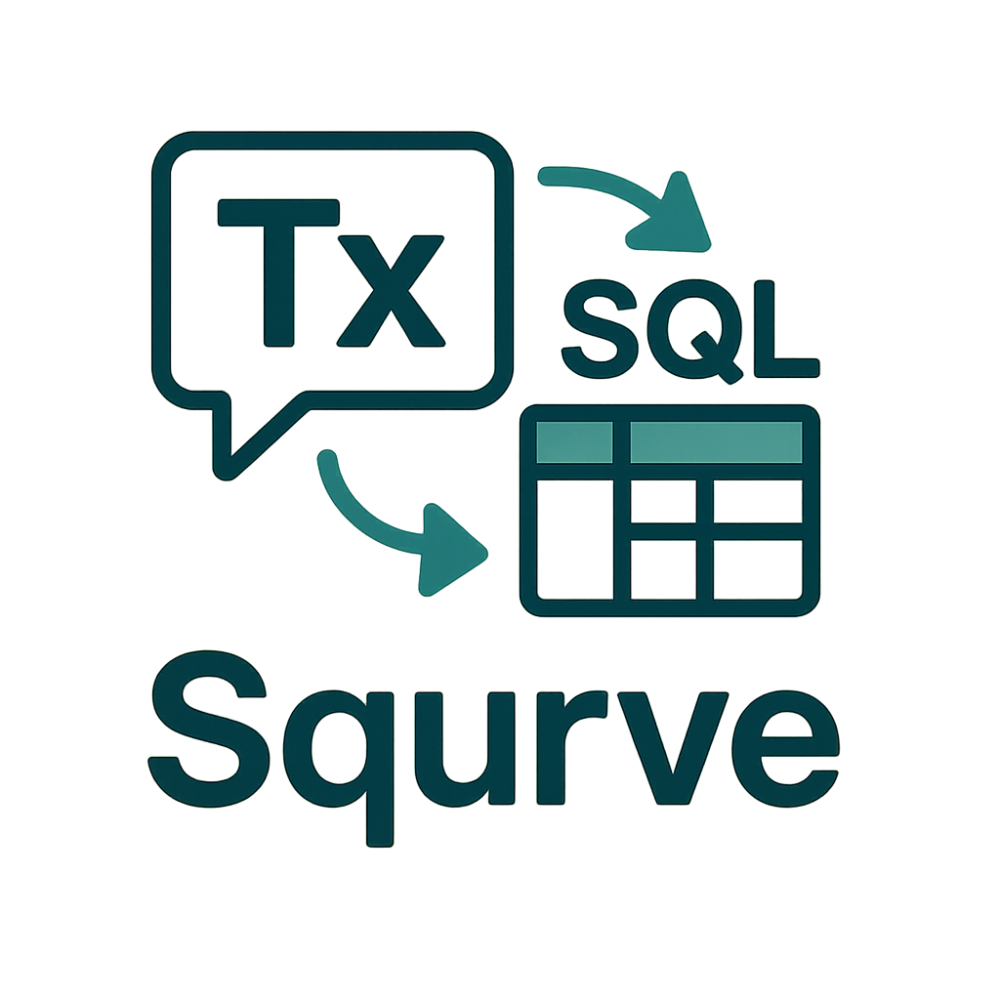
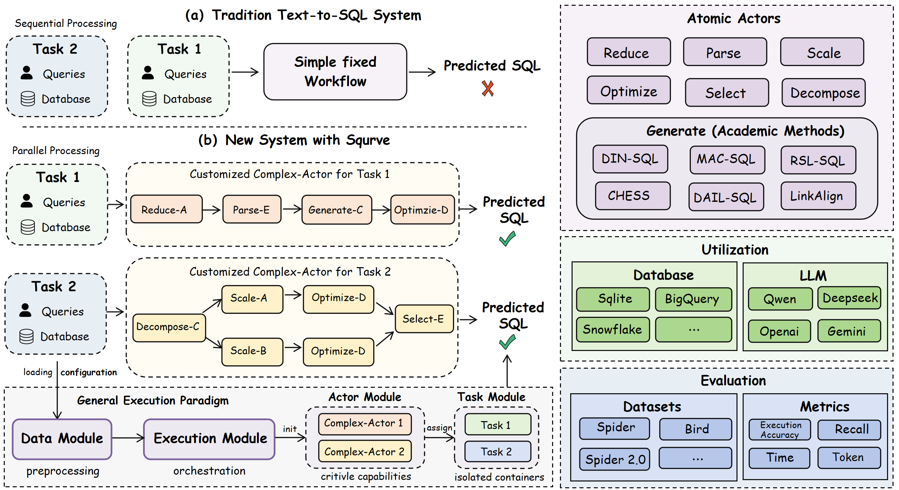
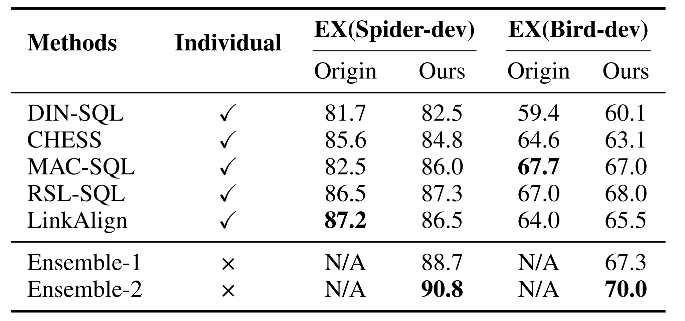

# Squrve

<div align="center">




</div>

## Overview

**Squrve**  is a lightweight and modular framework designed to help beginners in Text-to-SQL research quickly get
started. It enables one-click reproduction of multiple baseline methods and provides a unified evaluation pipeline,
making it
easy to compare different approaches under the same metrics.

We sincerely welcome students and researchers to try
Squrve, contribute new components, or report any issues. We will promptly evaluate and integrate valuable suggestions,
and we look forward to collaborating with the community to advance Text-to-SQL research.



## Quick Start

### 1. Environment Setup

Ensure your Python environment meets the following requirements:

- Python 3.8+
- Required dependencies (see requirements.txt)

```bash
# Clone the repository
git clone https://github.com/Satissss/Squrve.git

# Install dependencies
pip install -r requirements.txt

# Unzip benchmarks.zip to the root directory
unzip benchmarks.zip -d .
```

### 2. Configure API Keys

Edit the configuration file to add your API keys:

```json
{
  "api_key": {
    "qwen": "your_qwen_api_key",
    "deepseek": "your_deepseek_api_key",
    "zhipu": "your_zhipu_api_key"
  }
}
```

### [Opt.] LinkAlign Configuration

If using LinkAlign-related components, configure according
to https://github.com/Satissss/LinkAlign/blob/master/README.md.

### 3. Run Examples

#### Method 1: Using Startup Script

```bash
# Run Spider Dev dataset example
cd startup_run

python run.py
```

#### Method 2: Programmatic Approach

```python
from core.base import Router
from core.engine import Engine

# Initialize with configuration file
router = Router(config_path="startup_run/startup_config.json")
engine = Engine(router)

# Execute task
engine.execute()

# Evaluate results
engine.evaluate()
```

## Supported Atomic Actors

To tackle diverse and co-occuring difficulties in real-world scenarios, Squrve abstracts and formalizes seven atomic Actor components, each representing a distinct Text-to-SQL capability validated in prior research. Through Squrve's multi-actor collaboration mechanism, different actors can interact and cooperate  that effectively fuses their complementary strengths.

| Actor Types | Methods                          | Key Challenges |
|-------------|----------------------------------|----------------|
| Reduce      | LinkAlign                        | Large-scale and multi-database |
| Parse       | LinkAlign; RSL-SQL ...           | Ambiguous queries and redundant schemas |
| Generate    | DIN-SQL; CHESS ...               | Efficient and high-quality SQL generation |
| Decompose   | DIN-SQL; MAC-SQL                 | Chain-of-Thought for complex queries |
| Scale       | CHESS; CHASE-SQL; OpenSearch ... | Diverse and high-quality decoding strategies |
| Optimize    | CHASE-SQL; CHESS; OpenSearch ... | Effective and broader database feedback |
| Select      | CHASE-SQL; CHESS; MCS-SQL ...    | Accurate gold SQL identification |

### Reduce Actor
This component eliminates redundant schemas from large-scale databases that may exceed LLM context windows. 

### Parse Actor
This component performs schema linking by extracting tables and columns from candidate schemas that are potentially required for SQL generation.

### Generate Actor
This component generates complete SQL statements, encapsulating existing end-to-end academic methods.

### Decompose Actor
This component decomposes complex queries into multiple logically progressive sub-questions and generates SQL statements for each.

### Scale Actor
This component generates diverse high-quality SQL candidates to increase the probability of covering the gold SQL.

### Optimize Actor
This component leverages environmental feedback (e.g., database errors or results) to refine the quality of the generated SQL queries.

### Select Actor
This component selects the optimal SQL statement from multiple candidates, typically in collaboration with the scale actor.

## Supported Datasets

Squrve includes built-in support for several standard Text-to-SQL benchmarks for easy model evaluation and comparison:

| Benchmark | Involved Split | Description                                                               | Code Link                                                     |
|-----------|----------------|---------------------------------------------------------------------------|---------------------------------------------------------------|
| Spider    | dev \ test     | Cross-domain Text-to-SQL benchmark, supporting dev split.                 | https://github.com/taoyds/spider                                          |
| BIRD      | dev            | Text-to-SQL benchmark with external knowledge.                            | https://github.com/AlibabaResearch/DAMO-ConvAI/tree/main/bird |
| Spider2   | snow \ lite    | Extended version of Spider with more complex scenarios.                   | https://github.com/xlang-ai/Spider2                       |
| AmbiDB    | N/A            | A variant of Spider, enhancing ambiguity through multi-database settings. | https://huggingface.co/datasets/satissss/AmbiDB           |


## Supported LLM
Currently only supports LLM services through API calls.

* Qwen
* Deepseek
* Openai
* Zhipu
* Gemini
* ......

## Supported Database
The following are the database types currently supported by Squrve. We will continue to add more enterprise database systems as we extend our dataset support.

* Sqlite
* BigQuery
* Snowflake

## Experiments

Squrve successfully reproduces existing Text-to-SQL baselines under the same LLM backbone with performance closely aligned to their originally executed results. Building upon the reproduced components, we further demonstrate the extensibility and effectiveness of the Multi-Actor collaboration mechanism through evaluation on two variants.
As shown in Table below, both ensemble methods substantially outperform all individual baselines in both benchmarks.


## Documentation

### [API Documentation](API%20documents.md)
Complete API reference with detailed explanations of all configuration parameters and methods.
### [Startup Examples](startup_run/README.md)
Usage guide and configuration examples for the Spider Dev dataset

## Get Involved

We welcome active participation in improving and building Squrve. Contribute optimized methods, new components, or task-specific datasets to Squrve, making them accessible to the broader Text-to-SQL research community.


### Adding New Components
Define the Actor class and provide concrete implementations.

### Adding New Datasets
Refer to the API documentation to ensure valid formatting.

## Citation

If you find **Squrve** useful for your research or work, please consider citing it:

```bibtex
@article{wang2025squrve,
  title     = {Squrve: A Unified and Modular Framework for Complex Real-World Text-to-SQL Tasks},
  author    = {Wang, Yihan and Liu, Peiyu and Chen, Runyu and Pu, Jiaxing and Xu, Wei},
  journal   = {arXiv preprint arXiv:2510.24102},
  year      = {2025},
  url       = {https://doi.org/10.48550/arXiv.2510.24102}
}
```


