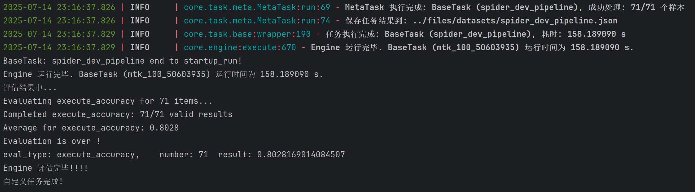

# Squrve 框架快速启动

本文件介绍如何基于 Squrve 框架，仅通过更换配置参数，即可实现不同数据集上对多种基线方法实现 Text-to-SQL 任务的表现并发测试。

## 🚀 快速开始

### 1. 环境准备

确保已按照根目录下的 [`README`](https://github.com/Satissss/Squrve) 文件完成所有环境配置步骤。

### 2. 运行示例

任何 Text-to-SQL 任务均可以通过 run.py 下的简单数行代码完成，仅需要提供任务启动所需的正确配置文件，如下。

```python 
from core.base import Router
from core.engine import Engine

if __name__ == "__main__":
    router = Router(config_path="startup_config.json")

    engine = Engine(router)

    # 执行任务
    print("执行自定义任务中...")
    engine.execute()

    # 评估结果
    print("评估结果中...")
    engine.evaluate()

    print("自定义任务完成!")

```

startup_config.json 作为快速启动示例，提供了一个在 Spider-dev 基准数据集上运行 DIN-SQL 方法的简单示例。通过运行 run.py 即可快速启动 Squrve 框架。

```bash
python startup_run/run.py
```


## 📁 运行成功

### 控制台输出

代码启动后，控制台首先输出基本信息。


单个样本执行过程信息打印：


样例测试运行完成后，输出评估结果和任务相关统计信息，如下所示：


运行完成后，结果文件将保存在以下目录：

### 文件夹输出

根据配置，生成的每个样本的 SQL 语句将保存在 `files/pred_sql/` 目录下： 
!

处理后的完整的数据集将保存在 `files/datasets/` 目录下：

## 🎯 解析配置

### 1. 简单生成任务 (`generate`)

直接生成 SQL 查询，跳过模式降维和模式链接步骤。

### 2. 完整流水线任务

执行完整的 Text-to-SQL 流程：

1. **模式降维** (`reduce`): 根据问题筛选相关数据库模式
2. **模式链接** (`parse`): 解析问题中提到的表和字段
3. **查询生成** (`generate`): 生成最终的 SQL 查询

### 3. 复杂任务

支持任务嵌套和并行执行：

- **串行执行**: 任务按顺序执行
- **并行执行**: 多个任务同时执行
- **嵌套任务**: 任务内部包含子任务

## 📊 配置文件详解

### Startup 测试配置 (`config/spider_dev_config.json`)

该配置文件提供了 Spider dev 数据集测试样例，包含以下主要部分：

#### LLM 配置

```json
{
  "llm": {
    "use": "qwen",
    "model_name": "qwen-turbo",
    "context_window": 120000,
    "max_token": 8000,
    "temperature": 0.75
  }
}
```

* use: 使用 Base LLM 类型

#### 数据集配置

```json
{
  "dataset": {
    "data_source": "spider:dev",
    "db_path": "benchmarks/spider/database"
  }
}
```

* data_source: 实验数据集，"spider:dev" benchmark已注册，支持自动解析。
* db_path: 连接数据库路径，系统配置仅提供支持的数据库配置

#### 任务配置

```json
{
  "task": {
    "task_meta": [
      {
        "task_id": "spider_dev_generate",
        "task_type": "generate",
        "data_source": "spider:dev",
        "schema_source": "spider:dev"
      }
    ]
  }
}
```

