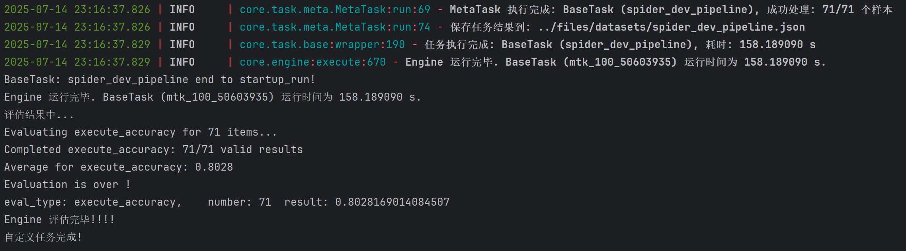
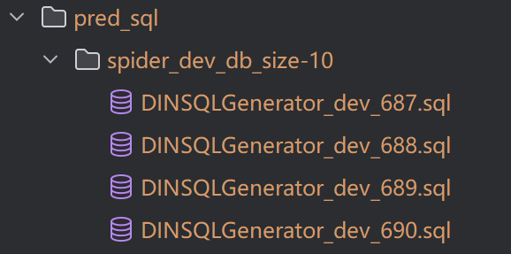

# Quick Start

This document explains how to use the Squrve framework to perform parallel Text-to-SQL benchmark tests across multiple baseline methods and datasets — all by simply switching configuration parameters.

## 🚀 Quick Start

### 1. Environment Setup

Make sure you have completed all environment setup steps described in the root directory’s [`README`](https://github.com/Satissss/Squrve).

### 2. Run an Example

Any Text-to-SQL task can be executed with just a few lines of code in `run.py`.
You only need to provide the correct configuration file required to start the task, as shown below:

```python 
from core.base import Router
from core.engine import Engine

if __name__ == "__main__":
    router = Router(config_path="startup_config.json")

    engine = Engine(router)

    # Execute the task
    print("Running custom task...")
    engine.execute()

    # Evaluate the results
    print("Evaluating results...")
    engine.evaluate()

    print("Custom task completed!")
```

The `startup_config.json` file provides a minimal example that runs the DIN-SQL method on the Spider-dev benchmark dataset.
You can quickly start the Squrve framework by running:

```bash
python startup_run/run.py
```


### 3. Successful Launch

Once the program starts, the console first outputs basic information:


Information for each individual sample execution will then be displayed:


After all sample tests finish, evaluation results and task statistics are printed as follows:



### 4. Output Results

The generated SQL statements are saved by default in the directory: `files/pred_sql/<datasource>`.


After all samples are processed, Squrve automatically evaluates the results based on the eval_type metrics (for example, execution accuracy of the generated SQL).
Each task’s aggregated result is returned as a Python dict, allowing users to decide how to store or process it.


Future versions will include dedicated tools for saving and visualizing result data.
