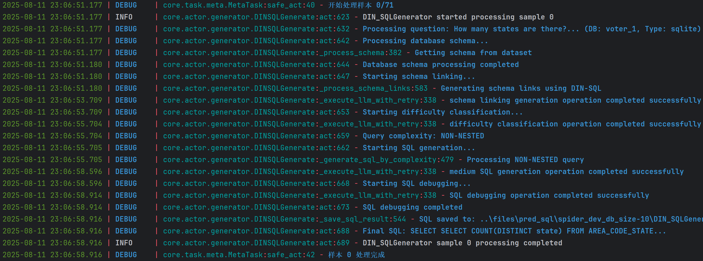

# Squrve 框架快速启动

本文件介绍如何基于 Squrve 框架，仅通过更换配置参数，即可实现不同数据集上对多种基线方法实现 Text-to-SQL 任务的表现并发测试。

## 🚀 快速开始

### 1. 环境准备

确保已按照根目录下的 [`README`](https://github.com/Satissss/Squrve) 文件完成所有环境配置步骤。

### 2. 运行示例

任何 Text-to-SQL 任务均可以通过 run.py 下的简单数行代码完成，仅需要提供任务启动所需的正确配置文件，如下。

```python 
from core.base import Router
from core.engine import Engine

if __name__ == "__main__":
    router = Router(config_path="startup_config.json")

    engine = Engine(router)

    # 执行任务
    print("执行自定义任务中...")
    engine.execute()

    # 评估结果
    print("评估结果中...")
    engine.evaluate()

    print("自定义任务完成!")

```

startup_config.json 作为快速启动示例，提供了一个在 Spider-dev 基准数据集上运行 DIN-SQL 方法的简单示例。通过运行 run.py 即可快速启动 Squrve 框架。

```bash
python startup_run/run.py
```


### 3. 成功启动

代码启动后，控制台首先输出基本信息。


单个样本执行过程信息打印：


样例测试运行完成后，输出评估结果和任务相关统计信息，如下所示：


运行完成后，结果文件将保存在以下目录：

### 4. 结果输出

生成 SQL 语句默认保存在 `files/pred_sql/<datasource>` 目录下： 


当所有样本任务结束后，Squrve 会按照 `eval_type` 提供的指标类型自动评估测试结果，例如：测试生成 SQL 的 execute accuracy。每个任务汇总的结果将封装在一个 `dict` 中返回，使用者可自主决定如何保存这一数据。后续将提供专门用于保存和可视化结果数据的工具。

